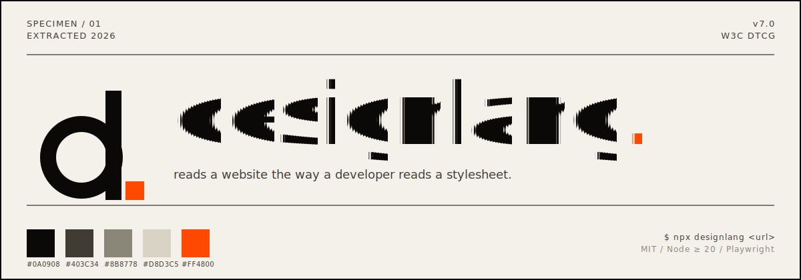

<p align="center">
  
</p>

<p align="center">
  <a href="https://www.npmjs.com/package/designlang"></a>
  <a href="https://github.com/Manavarya09/design-extract/blob/main/LICENSE"></a>
  <a href="https://nodejs.org"></a>
  <a href="https://design-extract-beta.vercel.app"></a>
</p>

---

<p align="center">
  
</p>

**designlang** crawls any website with a headless browser, extracts every computed style from the live DOM, and generates **8 output files** — including an AI-optimized markdown file, visual HTML preview, Tailwind config, React theme, shadcn/ui theme, Figma variables, W3C design tokens, and CSS custom properties.

But unlike every other tool out there, it also extracts **layout patterns** (grids, flexbox, containers), captures **responsive behavior** across 4 breakpoints, records **interaction states** (hover, focus, active), scores **WCAG accessibility**, and lets you **compare multiple brands** or **sync live sites to local tokens**.

## Quick Start

```bash
npx designlang https://stripe.com
```

Get everything at once:

```bash
npx designlang https://stripe.com --full
```

## What You Get (8 Files)

| File | What it is |
|------|------------|
| `*-design-language.md` | AI-optimized markdown — feed it to any LLM to recreate the design |
| `*-preview.html` | Visual report with swatches, type scale, shadows, a11y score |
| `*-design-tokens.json` | [W3C Design Tokens](https://design-tokens.github.io/community-group/format/) format |
| `*-tailwind.config.js` | Drop-in Tailwind CSS theme |
| `*-variables.css` | CSS custom properties |
| `*-figma-variables.json` | Figma Variables import (with dark mode support) |
| `*-theme.js` | React/CSS-in-JS theme (Chakra, Stitches, Vanilla Extract) |
| `*-shadcn-theme.css` | shadcn/ui globals.css variables |

The markdown output has **19 sections**: Color Palette, Typography, Spacing, Border Radii, Box Shadows, CSS Custom Properties, Breakpoints, Transitions & Animations, Component Patterns (with full CSS snippets), Layout System, Responsive Design, Interaction States, Accessibility (WCAG 2.1), Gradients, Z-Index Map, SVG Icons, Font Files, Image Style Patterns, and Quick Start.

In v7 a companion `*-mcp.json` file is also written alongside the 8 outputs so that `designlang mcp` can serve regions, components, and health data from disk on later invocations. Opting into `--platforms <csv>` additively emits `ios/`, `android/`, `flutter/`, and/or `wordpress-theme/` directories in the output folder, and `--emit-agent-rules` adds a `.cursor/`, `.claude/`, `CLAUDE.md.fragment`, and `agents.md` set.

## Install

```bash
# Use directly (no install needed)
npx designlang https://example.com

# Or install globally
npm install -g designlang

# As an agent skill (Claude Code, Cursor, Codex, 40+ agents)
npx skills add Manavarya09/design-extract
```

## What Makes This Different

Most design extraction tools give you colors and fonts. That's it. designlang fills 5 market gaps that no other tool addresses:

### 1. Layout System Extraction

Extracts the structural skeleton — grid column patterns, flex direction usage, container widths, gap values, and justify/align patterns.

```
Layout: 55 grids, 492 flex containers
```

Every other tool gives you the paint. designlang gives you the architecture.

### 2. Responsive Multi-Breakpoint Capture

Crawls the site at 4 viewports (mobile, tablet, desktop, wide) and maps exactly what changes:

```bash
designlang https://vercel.com --responsive
```

```
Responsive: 4 viewports, 3 breakpoint changes
  375px → 768px: Nav visibility hidden → visible, Hamburger shown → hidden
  768px → 1280px: Max grid columns 1 → 3, H1 size 32px → 48px
```

No other tool captures how the design *adapts*, just how it looks at one size.

### 3. Interaction State Capture

Programmatically hovers and focuses interactive elements, capturing the actual style transitions:

```bash
designlang https://stripe.com --interactions
```

```css
/* Button Hover */
background-color: rgb(83, 58, 253) → rgb(67, 47, 202);
box-shadow: none → 0 4px 12px rgba(83, 58, 253, 0.4);

/* Input Focus */
border-color: rgb(200, 200, 200) → rgb(83, 58, 253);
outline: none → 2px solid rgb(83, 58, 253);
```

### 4. Live Site Sync

Treat the deployed site as your source of truth, not Figma:

```bash
designlang sync https://stripe.com --out ./src/tokens
```

Detects design changes and auto-updates your local `design-tokens.json`, `tailwind.config.js`, and `variables.css`.

### 5. Multi-Brand Comparison

Compare N brands side-by-side:

```bash
designlang brands stripe.com vercel.com github.com linear.app
```

Generates a matrix with color overlap analysis, typography comparison, spacing systems, and accessibility scores. Outputs both `brands.md` and `brands.html`.

### 6. Clone Command

Generate a working Next.js app with the extracted design applied:

```bash
designlang clone https://stripe.com
cd cloned-design && npm install && npm run dev
```

One command → a running app with the site's colors, fonts, spacing, and component patterns.

### 7. Design System Scoring

Rate any site's design quality across 7 categories:

```bash
designlang score https://vercel.com
```

```
  68/100  Grade: D

  Color Discipline     ██████████░░░░░░░░░░ 50
  Typography           ██████████████░░░░░░ 70
  Spacing System       ████████████████░░░░ 80
  Shadows              ██████████░░░░░░░░░░ 50
  Border Radii         ████████░░░░░░░░░░░░ 40
  Accessibility        ███████████████████░ 94
  Tokenization         ████████████████████ 100
```

### 8. Watch Mode

Monitor a site for design changes:

```bash
designlang watch https://stripe.com --interval 60
```

Checks hourly and alerts when colors, fonts, or accessibility scores change.

### 9. Apply Command (NEW in v5)

Extract a site's design and write tokens directly into your project — auto-detects your framework:

```bash
designlang apply https://stripe.com --dir ./my-app
```

Detects Tailwind, shadcn/ui, or plain CSS and writes to the right config files automatically.

### 10. Auth Extraction (NEW in v5)

Extract from authenticated or protected pages with cookies and custom headers:

```bash
designlang https://internal-app.com --cookie "session=abc123" --header "Authorization:Bearer token"
```

### 11. Gradient Extraction (NEW in v5)

Detects all CSS gradients — type (linear/radial/conic), direction, color stops, and classifies them as subtle, brand, bold, or complex.

### 12. Z-Index Map (NEW in v5)

Builds a layer hierarchy from all z-index values, groups them into layers (base, sticky, dropdown, modal, etc.), and flags z-index wars or excessive values (>9999).

### 13. SVG Icon Extraction (NEW in v5)

Finds and deduplicates all inline SVGs, classifies them by size and style (outline/solid/duotone), and extracts the icon color palette.

### 14. Font File Detection (NEW in v5)

Identifies every font source — Google Fonts, self-hosted, CDN, or system — and generates ready-to-use `@font-face` CSS.

### 15. Image Style Patterns (NEW in v5)

Detects image aspect ratios, border treatments, filters, and classifies patterns like avatar, hero, thumbnail, and gallery.

### 16. Dark Mode Diffing (NEW in v5)

Compare light and dark mode side-by-side — see exactly which colors change and which CSS variables are overridden:

```bash
designlang https://vercel.com --dark
```

### 17. MCP Server (NEW in v7)

One-command integration with any MCP-aware AI agent (Cursor, Claude Code, Windsurf, and more):

```bash
designlang mcp --output-dir ./design-extract-output
```

Launches a stdio JSON-RPC server that exposes the extracted design as MCP resources and tools.

**Resources:**

- `designlang://tokens/primitive` — primitive token layer
- `designlang://tokens/semantic` — semantic token layer (with DTCG alias references)
- `designlang://regions` — classified page regions (nav, hero, pricing, etc.)
- `designlang://components` — reusable component clusters with variants
- `designlang://health` — CSS health audit

**Tools:**

- `search_tokens` — query tokens by name, value, or type
- `find_nearest_color` — snap any color to the nearest palette token
- `get_region` — fetch a classified region by name
- `get_component` — fetch a component cluster by id
- `list_failing_contrast_pairs` — list every WCAG-failing fg/bg pair with remediation suggestions

### 18. Multi-Platform Output (NEW in v7)

Emit iOS SwiftUI, Android Compose, Flutter, and WordPress block-theme files in a single run, in addition to the default web output:

```bash
designlang https://stripe.com --platforms all
```

Resulting tree:

```
design-extract-output/
├── stripe-com-*.{md,json,css,js,html}    (default web output)
├── ios/
│   └── DesignTokens.swift
├── android/
│   ├── Theme.kt
│   ├── colors.xml
│   └── dimens.xml
├── flutter/
│   └── design_tokens.dart               (+ buildDesignlangTheme())
└── wordpress-theme/
    ├── theme.json
    ├── style.css
    ├── functions.php
    ├── index.php
    └── templates/index.html
```

Values for `--platforms` are any comma-separated subset of `web,ios,android,flutter,wordpress,all`. The flag is additive — the default web output is always emitted.

### 19. Agent Rules Emitter (NEW in v7)

Write agent-facing rule files generated from the resolved semantic tokens:

```bash
designlang https://stripe.com --emit-agent-rules
```

Writes:

- `.cursor/rules/designlang.mdc` — Cursor rule
- `.claude/skills/designlang/SKILL.md` — Claude Code skill
- `CLAUDE.md.fragment` — snippet you can paste into your project's CLAUDE.md
- `agents.md` — generic, vendor-neutral agent guidance

Each file is templated from the semantic layer of the extracted token set, so the agent sees real token names and values — not placeholders.

### 20. Stack + Tailwind Fingerprint (NEW in v7)

Automatic framework, utility-class, and analytics detection surfaced on `design.stack`:

- **Framework**: Next.js, Nuxt, Gatsby, Remix, Astro, Shopify, WordPress, Framer, Webflow, and more.
- **Tailwind**: when Tailwind is in use, records utility-class frequency so you see which utilities drive the design.
- **Analytics**: inventory of analytics scripts — GA4, Plausible, PostHog, Segment, Mixpanel, Amplitude, and friends.

### 21. CSS Health Audit (NEW in v7)

A dedicated audit pass surfaced on `design.cssHealth`:

- Specificity graph (distribution, hotspots)
- `!important` count
- Duplicate declarations
- Unused CSS via the Playwright Coverage API
- `@keyframes` catalog
- Vendor-prefix audit

Also contributes a `cssHealth` dimension to the overall design score.

## All Features

| Feature | Flag / Command | Description |
|---------|---------------|-------------|
| Base extraction | `designlang <url>` | Colors, typography, spacing, shadows, radii, CSS vars, breakpoints, animations, components |
| Layout system | automatic | Grid patterns, flex usage, container widths, gap values |
| Accessibility | automatic | WCAG 2.1 contrast ratios for all fg/bg pairs |
| Design scoring | automatic | 7-category quality rating (A-F) with actionable issues |
| Gradients | automatic | Gradient type, direction, stops, classification |
| Z-index map | automatic | Layer hierarchy, z-index wars detection |
| SVG icons | automatic | Deduplicated icons, size/style classification, color palette |
| Font files | automatic | Source detection (Google/self-hosted/CDN/system), @font-face CSS |
| Image styles | automatic | Aspect ratios, shapes, filters, pattern classification |
| Dark mode | `--dark` | Extracts dark color scheme + light/dark diff |
| Auth pages | `--cookie`, `--header` | Extract from authenticated/protected pages |
| Multi-page | `--depth <n>` | Crawl N internal pages for site-wide tokens |
| Screenshots | `--screenshots` | Capture buttons, cards, inputs, nav, hero, full page |
| Responsive | `--responsive` | Crawl at 4 viewports, map breakpoint changes |
| Interactions | `--interactions` | Capture hover/focus/active state transitions |
| Everything | `--full` | Enable screenshots + responsive + interactions |
| Apply | `designlang apply <url>` | Auto-detect framework and write tokens to your project |
| Clone | `designlang clone <url>` | Generate a working Next.js starter with extracted design |
| Score | `designlang score <url>` | Rate design quality with visual bar chart breakdown |
| Watch | `designlang watch <url>` | Monitor for design changes on interval |
| Diff | `designlang diff <A> <B>` | Compare two sites (MD + HTML) |
| Multi-brand | `designlang brands <urls...>` | N-site comparison matrix |
| Sync | `designlang sync <url>` | Update local tokens from live site |
| History | `designlang history <url>` | Track design changes over time |
| MCP server | `designlang mcp` | Expose extraction as MCP resources + tools |
| Multi-platform | `--platforms <csv>` | Emit iOS / Android / Flutter / WordPress outputs |
| Agent rules | `--emit-agent-rules` | Cursor, Claude Code, generic agent rule files |
| Stack fingerprint | automatic | Framework + Tailwind + analytics detection |
| CSS health | automatic | Specificity, !important, unused CSS, keyframes |
| A11y remediation | automatic | Nearest palette color passing AA / AAA for every failing pair |
| Semantic regions | automatic | nav / hero / pricing / testimonials / cta / footer classification |
| Reusable components | automatic | DOM subtree + style-vector clustering with variants |
| DTCG tokens | default | W3C Design Tokens v1 with semantic + composite layers (`--tokens-legacy` for pre-v7) |

## Full CLI Reference

```
designlang <url> [options]

Options:
  -o, --out <dir>         Output directory (default: ./design-extract-output)
  -n, --name <name>       Output file prefix (default: derived from URL)
  -w, --width <px>        Viewport width (default: 1280)
  --height <px>           Viewport height (default: 800)
  --wait <ms>             Wait after page load for SPAs (default: 0)
  --dark                  Also extract dark mode styles
  --depth <n>             Internal pages to crawl (default: 0)
  --screenshots           Capture component screenshots
  --responsive            Capture at multiple breakpoints
  --interactions          Capture hover/focus/active states
  --full                  Enable all captures
  --cookie <cookies...>   Cookies for authenticated pages (name=value)
  --header <headers...>   Custom headers (name:value)
  --framework <type>      Only generate specific theme (react, shadcn)
  --platforms <csv>       Additional platforms: web,ios,android,flutter,wordpress,all (additive)
  --emit-agent-rules      Emit Cursor / Claude Code / CLAUDE.md / agents.md rule files
  --tokens-legacy         Emit pre-v7 flat design-tokens.json shape (backward compat)
  --no-history            Skip saving to history
  --verbose               Detailed progress output

Commands:
  apply <url>             Extract and apply design directly to your project
  clone <url>             Generate a working Next.js starter from extracted design
  score <url>             Rate design quality (7 categories, A-F, bar chart)
  watch <url>             Monitor for design changes on interval
  diff <urlA> <urlB>      Compare two sites' design languages
  brands <urls...>        Multi-brand comparison matrix
  sync <url>              Sync local tokens with live site
  history <url>           View design change history
  mcp                     Launch stdio MCP server (--output-dir <dir>)
```

## Example Output

Running `designlang https://vercel.com --full`:

```
  designlang
  https://vercel.com

  Output files:
  ✓ vercel-com-design-language.md (32.6KB)
  ✓ vercel-com-design-tokens.json (5.6KB)
  ✓ vercel-com-tailwind.config.js (3.4KB)
  ✓ vercel-com-variables.css (18.6KB)
  ✓ vercel-com-preview.html (31.8KB)
  ✓ vercel-com-figma-variables.json (12.4KB)
  ✓ vercel-com-theme.js (1.4KB)
  ✓ vercel-com-shadcn-theme.css (477B)
  ✓ screenshots/button.png
  ✓ screenshots/card.png
  ✓ screenshots/nav.png
  ✓ screenshots/hero.png
  ✓ screenshots/full-page.png

  Summary:
  Colors: 27 unique colors
  Fonts: Geist, Geist Mono
  Spacing: 18 values (base: 2px)
  Shadows: 11 unique shadows
  Radii: 10 unique values
  Breakpoints: 45 breakpoints
  Components: 11 types detected (with CSS snippets)
  CSS Vars: 407 custom properties
  Layout: 55 grids, 492 flex containers
  Gradients: 4 unique gradients
  Z-Index: 8 layers mapped
  Icons: 23 unique SVGs
  Font Files: 4 font sources detected
  Images: 6 style patterns
  Responsive: 4 viewports, 3 breakpoint changes
  Interactions: 8 state changes captured
  A11y: 94% WCAG score (7 failing pairs)
  Design Score: 68/100 (D) — 4 issues
```

## How It Works

1. **Crawl** — Launches headless Chromium via Playwright, waits for network idle and fonts
2. **Extract** — Single `page.evaluate()` walks up to 5,000 DOM elements collecting 25+ computed style properties, layout data, inline SVGs, font sources, and image metadata
3. **Process** — 17 extractor modules parse, deduplicate, cluster, and classify the raw data (including gradients, z-index layers, icons, fonts, and image patterns)
4. **Format** — 8 formatter modules generate output files
5. **Score** — Accessibility extractor calculates WCAG contrast ratios for all color pairs
6. **Capture** — Optional: screenshots, responsive viewport crawling, interaction state recording

## Agent Skill

Works with **Claude Code, Cursor, Codex, and 40+ AI coding agents** via the skills ecosystem:

```bash
npx skills add Manavarya09/design-extract
```

In Claude Code, use `/extract-design <url>`.

## Website

**[design-extract-beta.vercel.app](https://design-extract-beta.vercel.app)** — the brutalist product page.

## Contributing

See [CONTRIBUTING.md](CONTRIBUTING.md). PRs welcome!

## License

[MIT](LICENSE) - Manav Arya Singh
